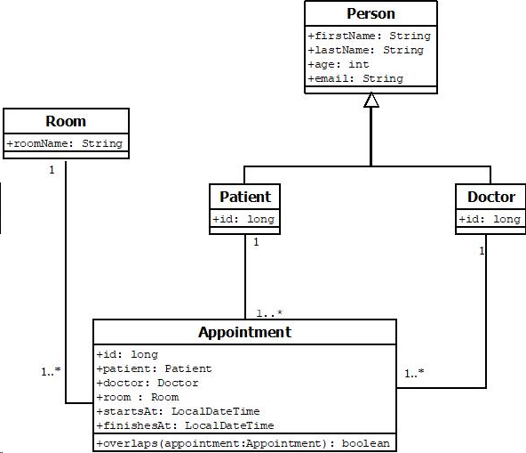

# Challenge Hospital Accenture

## Introduction
The project is developed in Java, specifically version 8,
and uses the Spring Boot 2.7.11 framework. Additionally, 
JUnit is employed for unit tests. 
In the area of controller testing, the Spring 
MVC Test framework is utilized.

Regarding project dependencies, Maven is used for 
managing dependencies, as well as for compiling 
and packaging the software.

### 🚀 How install the project

```bash
1. Install Java 8: https://www.oracle.com/java/technologies/javase/javase8-archive-downloads.html

2. set environment variables JAVA_HOME='C:\Program Files\Java\jdk-1.8'

3. Clone this repository: git clone https://github.com/nuwe-reports/6570e89f40cce1429859047d.git


Start developing!
```


### UML Diagram of Entities

>The following UML diagram provides a detailed visualization of
> the classes that make up the project, their relationships with 
> each other, and the inheritance structure in the system.

>
>
### Available resources in this API:

The API provides the capability to create medical appointments,
a process that requires the specification of key resources such 
as doctors, patients, and rooms. To manage these resources, the
API offers specific endpoints

💡 Click on the link to view the endpoints for each resource

- [show endpoints appointment](doc/endpoints/appointment.http)
- [show endpoints doctor](doc/endpoints/doctor.http)
- [show endpoints patient](doc/endpoints/patient.http)
- [show endpoints room](doc/endpoints/room.http)


---

### TEST
> The controllers, entities, and repositories are supported by a
> comprehensive battery of tests using the JUnit framework, ensuring
> code safety.

